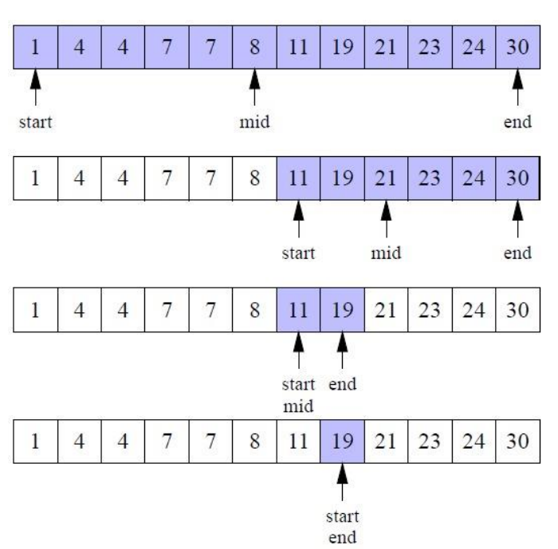

# Algoritmos e Tipos Abstratos de Dados

## Lab 3 | Exercícios + Template  

:gb: [English version](README_en.md)

Este repositório foi criado a partir de:

- <https://github.com/estsetubal-atad/CProgram_Template> 

Consulte o README se tiver dúvidas sobre a sua utilização.

----

**Objetivos**:

- Recursividade;

- Documentação Doxygen.

- Debugging;

**Referências**:

- Organização ATAD, documentação do software utilizado: <https://github.com/estsetubal-atad/Docs>

- Slides TP, disponíveis no Moodle.

---

:computer: Faça o clone **deste** repositório antes de avançar.

### Nível 1 (Duração estimada: < 20min)

:exclamation: As seguintes funções devem pertencer a um novo módulo `recursion`.

1. Defina e implemente a função `int arrayMinimum(int arr[], int arrLength)`, que devolve o valor mínimo encontrado no *array* `arr`. Pretende-se que `arrayMinimum` seja uma função recursiva que opere da seguinte forma (pseudo-código em linguagem natural):

    >
    > Se existir apenas um elemento, devolve-o.  
    >
    > Caso contrário, retorna o mínimo entre:  
    >
    >    a) O último valor;  
    >
    >    b) O valor retornado da chamada recursiva para os `(n-1)` primeiros elementos. 
    >

    :bulb: Sugere-se a implementação de uma função `int min(int, int)` que deve ser definida e declarada apenas em `recursion.c`, dado que será utilizada apenas aí.

2. Exemplifique a utilização desta função no `main` sobre o array `seq`; edite o *makefile*, compile e execute o programa.

### Nível 2 (Duração estimada: < 20min)

3. Defina e implemente a função `int arraySumEven(int arr[], int arrLength)`, que devolve a soma dos elementos pares no *array* `arr`. Pretende-se que `arraySumEven` seja uma função recursiva.

4. Exemplifique a utilização desta função no `main` sobre o array `seq` e valide o resultado.

5. No `main` implemente um pequeno excerto de código que verifique em que índice do array `seq` (inclusivé) a soma dos seus elementos pares anteriores atinge `890`.

    - Por exemplo, no índice `4` é atingido o valor `128`, i.e., a sub-sequência `{93, 32, 31, 36, 60}`.

### Nível 3 (Duração estimada: ~ 25min)

:book: Leia a *Adenda - Pesquisa Binária*.

6. Defina e implemente a função `binarySearch`, implementando o algoritmo fornecido.

7. Teste a função no `main`, criando e inicializando um array com os elementos ilustrados na figura e pesquise o elemento `19`. Pode testar depois com outros valores.

### Nível 4 e 5 (Duração estimada: ~ 25min)

:book: Leia a *Adenda - Algoritmo de ordenação Quicksort*.

8. Defina e implemente a função `quickSort`, implementando o algoritmo fornecido.

9. Teste a função no `main` sobre o array desordenado `seq`; imprima o conteúdo do array após a ordenação.

:exclamation: Para terminar, leia a *Adenda - Invocação*.

## Adenda

### Pesquisa Binária

Numa **sequência ordenada** é possível otimizar a pesquisa utilizando uma estratégia de partição 
sucessiva da sequência em duas metades, para diminuir o número de elementos a pesquisar.

A complexidade algorítmica desta pesquisa é `O(log n)`, mas necessita que a sequência esteja ordenada (caso contrário, tem de ser feita *a priori* - **não compensa face a uma *pesquisa sequencial***)



Na figura anterior podemos verificar um caso de sucesso de uma pesquisa binária pelo valor `19`: 

1. Na primeira iteração, calcula-se o 
elemento médio da sequência através 
da divisão inteira da soma das posições 
mínima e máxima (`start` e `end`), que 
neste caso é o elemento de índice `5`. 

2. Como o valor procurado é `19`, é maior 
do que o valor armazenado no 
elemento médio, significa que se 
encontra na segunda metade da 
sequência, passando a posição 
mínima (`start`) para o elemento à direita 
da posição média, neste caso, `11`.

3. A análise repete-se, desta vez, o valor 
procurado é menor do que o valor do 
elemento médio, pelo que este se vai 
encontrar na primeira metade, 
passando por isso, o valor máximo 
(`end`) para o elemento à esquerda do 
valor médio.

4. Quando a posição média coincide 
com o valor procurado, a pesquisa 
termina com sucesso, devolvendo o índice desse elemento (neste caso, índice `7`).

5. Se o ajuste de `start` e `end` resultar num "array vazio", então não existe e devolve `-1`

#### Algoritmo Recursivo

Em pseudo-código:

```markdown
Algorithm binarySearch
    input: val - integer
           arr - array of integers
           start - start index for search - natural number
           end - end index for search - natural number
    output: arr index of val; -1 if not found - integer
BEGIN
    IF start > end THEN
        RETURN -1

    mid <- (start + end) / 2

    IF arr[mid] = val THEN
        RETURN mid
    ELSE IF arr[mid] > val THEN
        RETURN binarySearch(val, arr, start, mid - 1)
    ELSE
        RETURN binarySearch(val, arr, mid + 1, end)
    END IF 
END
```

### Algoritmo de ordenação Quicksort

O algoritmo [*quicksort*](https://en.wikipedia.org/wiki/Quicksort) é um algoritmo de ordenação assente no princípio "dividir-para-conquistar" e pode ser implementado de forma recursiva. A sua complexidade algorítmica *average-case* é de `O(n log n)`, i.e., mais eficiente que *bubble* ou *selection* sort.

Pretende-se que, dado o algoritmo, seja capaz de o traduzir para a linguagem C.

#### Algoritmo Recursivo

Em pseudo-código próximo de implementação:

:bulb: `swap` significa "trocar" os elementos nas posições indicadas.

```markdown
/* low  --> Starting index,  high  --> Ending index */
quickSort(arr[], low, high)
{
    if (low < high)
    {
        /* pi is partitioning index, arr[pi] is now
           at right place */
        pi = partition(arr, low, high);

        quickSort(arr, low, pi - 1);  // Before pi
        quickSort(arr, pi + 1, high); // After pi
    }
}

/* This function takes last element as pivot, places
   the pivot element at its correct position in sorted
    array, and places all smaller (smaller than pivot)
   to left of pivot and all greater elements to right
   of pivot */
partition (arr[], low, high)
{
    // pivot (Element to be placed at right position)
    pivot = arr[high];  
 
    i = (low - 1)  // Index of smaller element and indicates the 
                   // right position of pivot found so far

    for (j = low; j <= high- 1; j++)
    {
        // If current element is smaller than the pivot
        if (arr[j] < pivot)
        {
            i++;    // increment index of smaller element
            swap arr[i] and arr[j]
        }
    }
    swap arr[i + 1] and arr[high]
    return (i + 1)
}
```

### Invocação

Embora não seja solicitado neste trabalho, a invocação dos algoritmos seguintes pode ser feita de forma "tradicional", face ao lecionado. Exemplo:

```cpp
int findIndexOf(int val, int arr[], int arrLength) {
    /* First call of binary search to include the whole array */
    return binarySearch(val, arr, 0, arrLength - 1);
}
```

Ou seja, mantemos a "interface" tradicional que esconde detalhes de invocação do algoritmo. O mesmo pode ser feito, analogamente, para o algoritmo *quick sort*.

---

```markdown
@bruno.silva
(EOF)
``` 