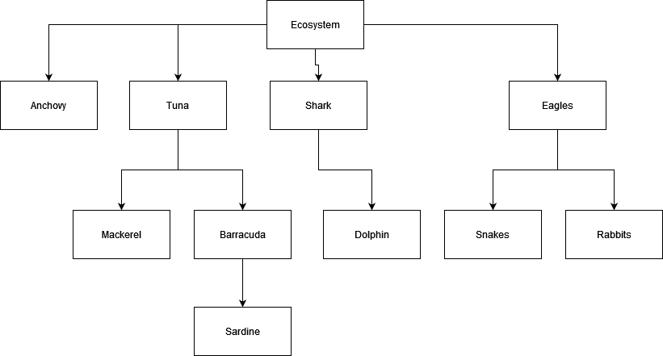

# Programação Avançada | Lab3

:gb: [English version](README_EN.md)

## Objetivos:

-   Compreender a implementação do **ADT Tree**;
-   Utilização do **ADT Tree**;
-   Desenvolvimento de testes unitários.

## 0 – Introdução

Pretende-se representar uma estrutura de um ecossistema como apresentado na Figura 1.

Figura 1 – Exemplo de estrutura de um ecossistema.

Para tal, optou-se por usar o **ADT Tree**, disponibilizado em:

	<a href="https://github.com/estsetubal-pa-2024-25/lab03_template_24_25">https://github.com/estsetubal-pa-2024-25/lab03_template_24_25</a>

## Nível 1 – Criação da árvore

-   Crie na classe ***Main*** uma instância de **TreeLinked**, para armazenar elementos do tipo **String**, cujo nó ***root*** deverá ter o valor “*Ecosystem*”. Adicione à estrutura os restantes elementos presentes na Figura 1;

-   Execute o método *main()*, invocando o método *toString()* da árvore criada e confirme que a estrutura está de acordo com a estrutura da **Figura 1**.

**NOTA:** Todos os métodos seguintes deverão ser implementados invocando métodos já implementados na classe *TreeLinked* (não é necessário fazer qualquer alteração na implementação da classe).

## Nível 2 – Implementação de testes unitários

Crie os seguintes testes unitários na classe **TreeLinkedTest** (*sugere-se que usem a árvore criada no* **main***, como árvore base de teste*):

-   **testIsEmpty()**;

-   **testIsExternal()**;

-   **testIsRoot()**;

-   **testSize()**.

## Nível 3 – Implementação de testes unitários (continuação)

Crie os seguintes testes unitários (*sugere-se que seja usada a árvore que criada no* ***main***, *como árvore base de teste*):

-   **testInsertShouldReturnCorrectPosition()**;

-   **testRemoveShouldReturnCorrectPosition()**;

-   **testInsertThrowsInvalidPositionException()**.

## Nível 4 – Implementação de métodos

Adicione à interface **Tree**, o método **degree** que devolve o *grau* de um nó (posição) da árvore e faça a respetiva implementação:

**public int degree(Position\<E\> position) throws InvalidPositionException**

-   Crie os respetivos testes unitários na classe **TreeLinkedTest**, que validem o resultado da execução deste método;

## Nível 5 – Implementação de testes unitários

Implemente os testes unitários que achar relevante para testar os seguintes métodos:

-   **public Iterable\<E\> elements();**
-   **public Iterable\<Position\<E\>\> children(Position\<E\> position) 
     throws InvalidPositionException;**

