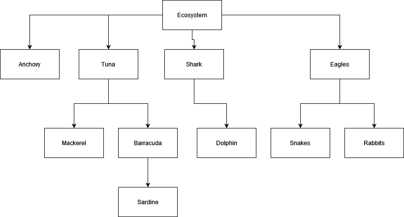

# Programação Avançada | Lab3

🇬🇧 [Versão em Português](README.md)

**Goals:**

-   Understanding of **ADT** Tree implementation;
-   Use of **ADT Tree**;
-   Development of **unit tests**.

# 0 – Introduction

It aims to represent a structure of an ecosystem as shown in Figure 1.

Figure 1– Example of an ecosystem structure

To this end, we chose to use the ADT Tree, available at:

	<a href="https://github.com/estsetubal-pa-2024-25/lab03_template_24_25">https://github.com/estsetubal-pa-2024-25/lab03_template_24_25</a>

## Level 1 – Tree creation

* Create, in the **Main** class, a **TreeLinked** instance to store elements of type **String**, whose **root node** must have the value “*Ecosystem*”. Add to the structure all the other elements presented in Figure1;

-   Execute the *main()* method, invoking the *toString() method* of the created tree, and confirm that the structure is in accordance with the structure in **Figure 1**.

**NOTE:** All of the following methods must be implemented by invoking methods already implemented in the *TreeLinked class* (it is not necessary to make any changes to the class implementation).

## Level 2 – Implementation of unit tests

Create the following unit tests in the **TreeLinkedTest** class ( *it is suggested that you use the tree you created in* **main** *as the base test tree* ):

-   **isEmpty()**;

-   **isExternal()**;

-   **isRoot()**;

-   **size()**.

## Level 3 – Implementation of unit tests (continued)

Create the following unit tests ( *it is suggested that you use the tree you created in* ***main*** *as the base test tree* ):

-   **testInsertShouldReturnCorrectPosition()**;

-   **testRemoveShouldReturnCorrectPosition()**;

-   **testInsertThrowsInvalidPositionException()**.

## Level 4 – Implementation of methods

-   Add the following method to the **Tree** interface (and its implementation):

**public int degree(Position\<E\> position) throws InvalidPositionException**

Returns the degree of a node in the given tree

-   Create the respective unit test in the **TreeLinkedTest class**, which validates the call of this function:

## Level 5 – Implementation of unit tests

Implement unit tests to test the following methods:

-   **public Iterable\<E\> elements();**

-   **public Iterable\<Position\<E\>\> children(Position\<E\> position) 
     throws InvalidPositionException;**

