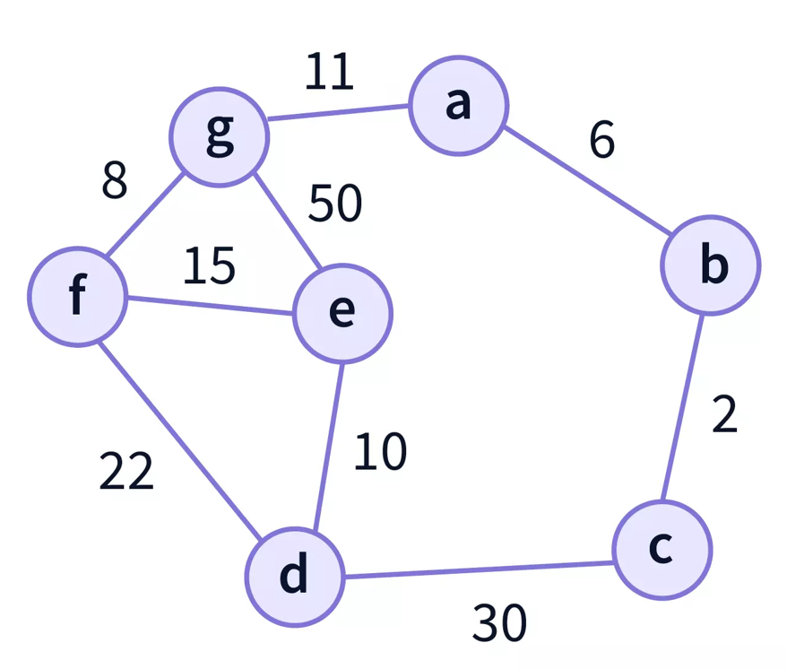
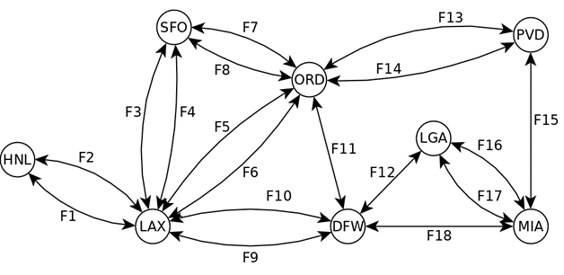

# Advanced Programming | Lab5

## Objectives
- Introduction to ADT Graph;
- Information modeling using graphs;
- Simple algorithm with graphs.

## 1 - Introduction

Graphs (see Figure 1) are a fundamental data structure in computing theory and discrete mathematics, widely used to model relationships between objects. They consist of a set of vertices (or nodes) connected by edges (or arcs). Graphs can be directed, where the edges have one direction, or undirected, where the edges are bidirectional. The example in the figure illustrates an undirected graph.

Graphs are a versatile tool for solving a variety of problems in different fields such as computer science, engineering, logistics, social media, biology and more. They are used to represent connections between elements, such as computer networks, navigation routes, social relationships, data structures, among others.

There are several properties and algorithms associated with graphs, such as breadth-first and depth-first search, shortest path algorithms, connectivity analysis, and graph coloring. Graphs are a crucial foundation for solving complex problems, helping to optimize processes, model real-world systems, and identify patterns in data, making them an essential tool in many domains of science and technology.

Figure 1 - Example of graph

### ADT Chart

Graphs, like data structures, can be implemented in several ways. For your use we will abstract these details and use them in the form of an ADT.

#### Representation

This ADT Graph<V, E> is **characterized by modeling graphs** that have:
• Vertices of type Vertex<V>, which internally store elements of generic type V, and;
• Edges of type Edge<E, V>, which internally store elements of generic type E and which connect vertices of type Vertex<V>;
In the case of Figure 1, for example, V will be of type Character and E will be of type Integer.

⚠️The Vertex<V> and Edge<E, V> types are analogous to the Position<T> type of the ADT Tree.

#### Operations
The operations available are the following:
- **int numVertices()**: Returns the total number of vertices in the graph.
- **int numEdges()**: Returns the total number of edges in the graph.
- **Collection<Vertex<V>> vertices()**: Returns a collection of all vertices in the graph. If there are no vertices, it returns an empty collection.
- **Collection<Edge<E, V>> edges()**: Returns a collection of all edges in the graph. If there are no edges, it returns an empty collection.
- **Collection<Edge<E, V>> incidentEdges(Vertex<V> v)**: Returns a collection of edges incident to a specified vertex.
- **Vertex<V> opposite(Vertex<V> v, Edge<E, V> e)**: Returns the vertex opposite a given vertex along a given edge.
- **boolean areAdjacent(Vertex<V> u, Vertex<V> v)**: Checks if two vertices are adjacent, that is, if there is an edge that connects them.
- **Vertex<V> insertVertex(V vElement)**: Inserts a new vertex with a given element into the graph.
- **Edge<E, V> insertEdge(Vertex<V> u, Vertex<V> v, E edgeElement)**: Inserts a new edge between two existing vertices in the graph.
- **Edge<E, V> insertEdge(V vElement1, V vElement2, E edgeElement)**: Inserts a new edge between two existing vertices, specified by their elements.
- **V removeVertex(Vertex<V> v)**: Removes a vertex and all incident edges, returning the element of the removed vertex.
- **E removeEdge(Edge<E, V> e)**: Removes an edge, returning the element of the removed edge.
- **V replace(Vertex<V> v, V newElement)**: Replaces the element of a vertex with a new element and returns the previous element.
- **E replace(Edge<E, V> e, E newElement)**: Replaces the element of an edge with a new element and returns the previous element.

#### Library

The ADT Graph, classes for visualization and basic implementations are contained in the JavaFX SmartGraph library, available at:
https://github.com/brunomnsilva/JavaFXSmartGraph

🧐You can and should consult the repository to view examples of use.

📝 You can consult the Javadoc of the Graph<V,E> interface at:
https://javadoc.io/doc/com.brunomnsilva/smartgraph/latest/com/brunomnsilva/smartgraph/graph/Graph.html

⚙️ This library is already part of the cloned project, through a Maven dependency.

## Part 1 – Simple example
1. In the FirstProgram class, complete the code to model the graph in Figure 1, using the following methods:
- Vertex<V> insertVertex(V vElement)
- Edge<E, V> insertEdge(Vertex<V> u, Vertex<V> v, E edgeElement)

2. Run the program and check if the graph visualization matches what is desired.

## Part 2 – Flight modeling application

The FlightsProgram class launches a JavaFX application for viewing and manipulating a set of airports and flights between them.

1. Launch the program and view its interface. At this moment the modeled graph dit will always be empty and the buttons still do not correctly manipulate the graph. Additionally, the statistics displayed at the bottom of the window also still do not show correct values.

### Initial Modeling

2. In the FlightsView.createInitialModel() method, model the graph illustrated in Figure 2. Table 1 contains information about the flights illustrated.

Figure 2 - American airports and respective flights

| Edge |Code|Distance (mil.)|Company|
|:------:|:----:|:----:|:----:|
| F1 |UN3563|2555|United|
| F2 |DT1597|2555|Delta|
| F3 |UN9375|337|United|
| F4 |AM4526|337|American|
| F5 |UN4836|1743|United|
| F6 |VA2001|1743|Virgin America|
| F7 |UN1475|1843|United|
| F8 |AL7854|1843|Alaska|
| F9 |SP1020|1233|Spirit|
| F10 |AM4582|1233|American|
| F11 |UN4568|802|United|
| F12 |SP4512|1387|Spirit|
| F13 |AM4520|849|American|
| F14 |UN7812|849|United|
| F15 |FT1000|1205|Frontier|
| F16 |FT4021|1099|Frontier|
| F17 |AM1026|1099|American|
| F18 |AM5267|1120|American|

Table 1 – Description of the flights in Figure 2.

3. Launch the app again and check if the model shown matches what you expect.

#### Manipulation

4. Implement the following methods by manipulating the existing instance (attribute) of Graph<Airport, Flight>:

   1. FlightsView.addAirport(String airportCode)
   2. FlightsView .addFlight(Vertex<Airport> vertexFrom, Vertex<Airport> vertexTo, String code, String distance)
   3. removeFlight(Edge<Flight, Airport> edge)
   4. removeAirport(Vertex<Airport> vertex)

5. Launch the application again and freely manipulate the model through user interaction.

#### Statistics

6. Implement the FlightsView method. updateStatistics(), responsible for populating the statistics at the bottom of the window. The statistics to be calculated/shown are:

    1. Total number of airports;
    2. Total number of flights;
    3. Airport with the most traffic (vertex with highest degree);
    4. Number of airport connections with the most traffic (incident edges)

7. Launch the application again and check that the statistics are calculated correctly for the various states of the graph obtained after free manipulation.

#### Program correction

Properly test all program usage situations and handle any errors that occur appropriately.

(end of statement)