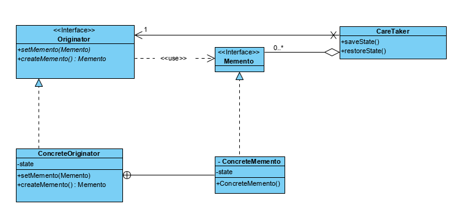

# Advanced Programming | Lab8

## Objectives
- Application of the Memento software standard

## 1 - Introduction

The Memento pattern allows you to save the current state of an object so that it can be recovered after changes, i.e. undo.

In this laboratory we intend to offer support for the undo operation in a shopping cart, so that products can be added to the cart and undo.

The pattern dictates that there is an **Originator** object with a state that will be saved through a **Memento** object, managed by a **CareTaker**. **CareTaker**'s responsibility is simply to save **Originator** states so that it can recover them.

To promote encapsulation in the use of the pattern, an adapted version of the original **Memento** pattern is proposed, which defines **Originator** and **Memento** interfaces, implementing the state (**ShoppingCartMemento**) as a class internal to the **Originator** (ShoppingCart) instance.

Figure 1 - UML diagram of the Memento pattern

In this implementation of the pattern we will have the following correspondences:
- Concrete Originator -> ShoppingCart
- ConcreteMemento -> ShoppingCartMemento

## 2 - Exercises

1. Level 1
   1. Start by running the program, familiarizing yourself with the GUI and features provided. Notice that the Undo button is not working.
   2. Change the **ShoppingCart** class so that it implements the **Originator** interface.
   3. Implement the *inner class* **ShoppingCartMemento**, which implements the Memento interface

2. Level 2
   1. Create the **Caretaker** class, with the following attributes:
      - **Memento memento**
      - **Originator originator**
   2. Implement the Constructor method.
   3. Implement the **void saveState()** method, which should obtain and save the current Memento.
   4. Implement the **void restoreState()** method, which should reestablish the state of the **originator** based on the saved **Memento**. If there is no **Memento** saved, you must throw the exception **NoMementoException**.

3. Level 3
   1. Add a **Caretaker** attribute to **ShoppingCartController**.
   2. Modify the **addProduct**, **reset** and **removeProduct** methods so that it starts saving the previous state, each time the shopping cart state is modified.
   3. Implement the **void undo()** method that uses the **caretaker** instance to retrieve the previous state of the shopping cart.
   4. Modify the **ShoppingCartPanel** class to add behavior to the **buttonUndo** button, to allow **an undo** after inserting a product into the shopping list.
4. Level 4
   1. Add the **buttonReset** button in the **ShoppingCartPanel** class and add it next to the **Undo** button.
   2. Add the **buttonReset** button behavior to reset the shopping list.
   3. Verify that the *undo* feature continues to work as expected.
5. Level 5
   1. Change the Caretaker class to implement multiple undo operations.

(end of statement)